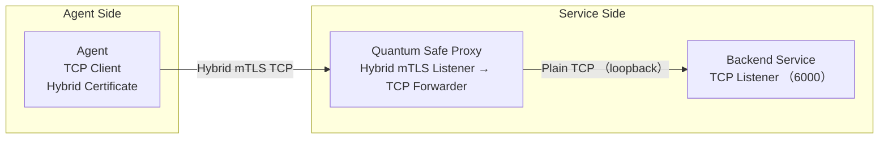
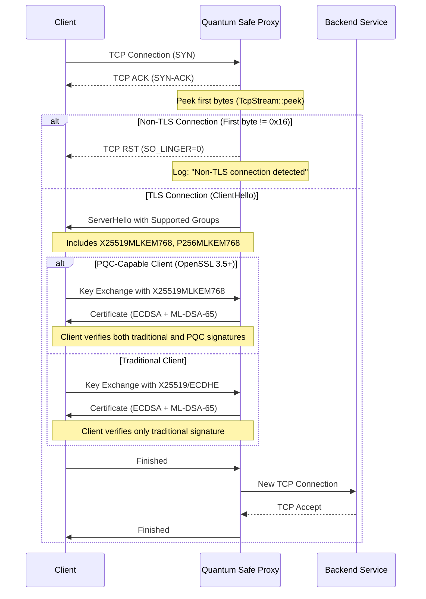
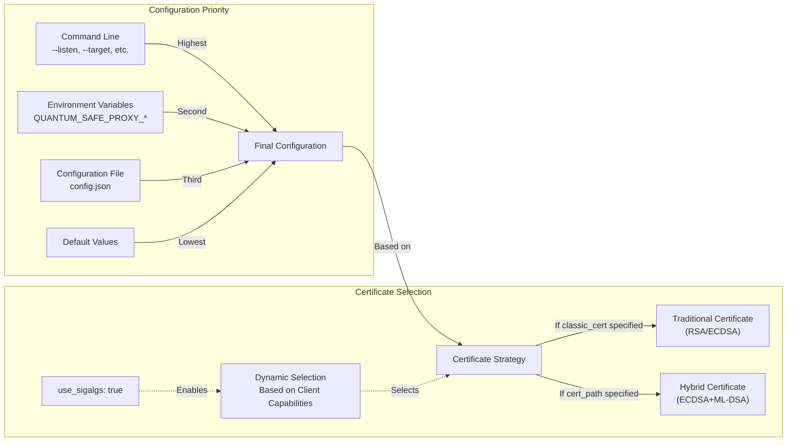
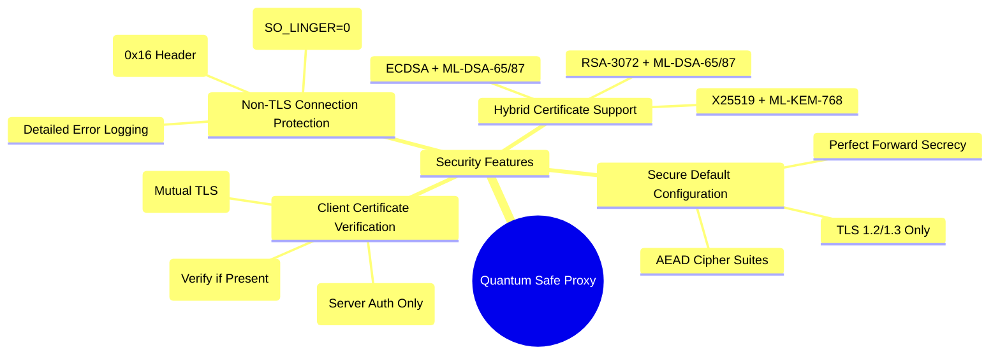

# Quantum Safe Proxy: PQC-Enabled Sidecar with Hybrid Certificate Support

[](https://github.com/JerryR7/quantum-safe-proxy/actions/workflows/rust.yml)
[](https://opensource.org/licenses/MIT)
[](https://crates.io/crates/quantum-safe-proxy)
[](https://docs.rs/quantum-safe-proxy)

## 1. Overview

**Quantum Safe Proxy** is a lightweight TCP proxy designed to secure long-lived connections using **Post-Quantum Cryptography (PQC)** with **hybrid X.509 certificates**. It enables secure mTLS communication via **OpenSSL with post-quantum support**, supporting both traditional and quantum-resistant algorithms through hybrid negotiation.

### Key Goals

- Enable secure communication using **hybrid PQC + classical certificates** (e.g., Kyber + ECDSA)
- Support both PQC-capable and legacy clients transparently
- Deployable as a **sidecar proxy** with no modifications required to existing services
- Provide future-proof security against quantum computing threats

## 2. Architecture

### High-Level Architecture




### How It Works

1. **Client Connection**: Clients connect to the proxy using TLS with hybrid certificates
2. **TLS Termination**: Proxy performs TLS handshake with hybrid certificate support
3. **Certificate Validation**: Mutual TLS authentication with client certificate verification
4. **Traffic Forwarding**: Decrypted traffic is forwarded to the backend service
5. **Response Handling**: Responses from the service are encrypted and sent back to the client

## 3. Key Features

- **Hybrid Certificate Support**: Seamlessly works with hybrid X.509 certificates (Kyber + ECDSA)
- **Quantum-Safe Algorithms**: Support for post-quantum algorithms like Kyber and Dilithium
- **Transparent PQC Integration**: Handles both PQC and traditional clients
- **Automatic Provider Detection**: Automatically detects and uses OpenSSL 3.5+ with built-in PQC support
- **Environment Diagnostics**: Provides tools to check and diagnose the cryptographic environment
- **Docker Integration**: Pre-built Docker images with OpenSSL 3.5+ included
- **Efficient TCP Proxying**: High-performance data forwarding with Tokio async runtime
- **Complete mTLS Support**: Client and server certificate validation
- **Non-TLS Protection**: Automatically detects and rejects non-TLS connections with TCP RST
- **Flexible Configuration**: Command-line arguments, environment variables, and config files
- **Containerized Deployment**: Docker, docker-compose, and Kubernetes support

## 4. TLS Handshake Details

### TLS Handshake Process

The proxy secures connections using a hybrid TLS handshake that supports both quantum-resistant and traditional clients:



The handshake process:
1. Detects and rejects non-TLS connections by examining the first bytes
2. Offers both traditional and post-quantum key exchange methods
3. Adapts to client capabilities, using hybrid algorithms with PQC-capable clients
4. Maintains backward compatibility with traditional clients
5. Establishes a secure tunnel to the backend service


## 5. Technology Stack

| Component | Technology |
|-----------|------------|
| **Language** | Rust |
| **TLS Library** | OpenSSL 3.5+ with built-in PQC support |
| **Proxy Runtime** | tokio + tokio-openssl |
| **Deployment** | Docker / Kubernetes / Systemd sidecar mode |
| **Certificate Tools** | OpenSSL 3.5+ CLI (hybrid CSR and certificates) |

## 6. Installation

### System Requirements

- Linux operating system (Ubuntu, Debian, etc.)
- OpenSSL 3.5.0 or newer with built-in PQC support (installed at `/opt/openssl35/` or specified via `OPENSSL_DIR`)
- Rust 1.70.0 or newer (if compiling from source)
- Docker 20.10.0 or newer (for containerized deployment)

### Option 1: From Crates.io

```bash
cargo install quantum-safe-proxy
```

### Option 2: From Source

```bash
# Clone the repository
git clone https://github.com/JerryR7/quantum-safe-proxy.git
cd quantum-safe-proxy

# Build with default OpenSSL 3.5.0 path
cargo build --release

# Or specify a custom OpenSSL path
OPENSSL_DIR=/path/to/openssl cargo build --release
```

The project uses a `build.rs` script that automatically embeds the OpenSSL library path into the binary, so you don't need to set environment variables when running the program.

### Option 3: Using Docker (Recommended)

Using Docker is the simplest method, as it doesn't require installing OpenSSL 3.5.0 on your local machine:

```bash
# Pull the image
docker pull jerryr7/quantum-safe-proxy:latest

# Or build locally
docker build -t quantum-safe-proxy .

# Using docker-compose
docker-compose up

# Or directly using docker command
docker build -t quantum-safe-proxy:openssl35 -f docker/Dockerfile.openssl35 .
docker run -p 8443:8443 quantum-safe-proxy:openssl35
```

### Option 4: Manual OpenSSL 3.5+ Installation

If you need to install OpenSSL 3.5.0 or newer on your local machine:

```bash
# Install build tools
sudo apt-get update
sudo apt-get install -y build-essential git

# Download OpenSSL 3.5.0 source code (or newer version)
mkdir -p ~/src
cd ~/src
git clone --depth 1 --branch openssl-3.5.0 https://github.com/openssl/openssl.git
# For newer versions, use the appropriate branch name, e.g., openssl-3.7.0

# Compile and install OpenSSL
cd openssl
./config --prefix=/opt/openssl35 \
         --openssldir=/opt/openssl35/ssl \
         --libdir=lib \
         enable-shared \
         -Wl,-rpath=/opt/openssl35/lib
make -j$(nproc)
sudo make install

# Create symbolic links if needed
if [ -d /opt/openssl35/lib64 ] && [ ! -d /opt/openssl35/lib ]; then
    sudo ln -s /opt/openssl35/lib64 /opt/openssl35/lib
elif [ -d /opt/openssl35/lib ] && [ ! -d /opt/openssl35/lib64 ]; then
    sudo ln -s /opt/openssl35/lib /opt/openssl35/lib64
fi

# Verify the installation
/opt/openssl35/bin/openssl version
/opt/openssl35/bin/openssl list -kem-algorithms | grep -i ML-KEM
/opt/openssl35/bin/openssl list -signature-algorithms | grep -i ML-DSA
```

Alternatively, you can use our provided script:

```bash
# Run the installation script
./scripts/openssl35-install.sh
```

## 7. Usage

### Basic Usage

```bash
quantum-safe-proxy --listen 0.0.0.0:8443 --target 127.0.0.1:6000 --cert certs/hybrid/dilithium3/server.crt --key certs/hybrid/dilithium3/server.key --ca-cert certs/hybrid/dilithium3/ca.crt --client-cert-mode optional
```

### Using Environment Variables

```bash
# Set environment variables
export QUANTUM_SAFE_PROXY_LISTEN="0.0.0.0:9443"
export QUANTUM_SAFE_PROXY_TARGET="127.0.0.1:7000"
export QUANTUM_SAFE_PROXY_CERT="certs/hybrid/dilithium3/server.crt"
export QUANTUM_SAFE_PROXY_KEY="certs/hybrid/dilithium3/server.key"
export QUANTUM_SAFE_PROXY_CA_CERT="certs/hybrid/dilithium3/ca.crt"
export QUANTUM_SAFE_PROXY_LOG_LEVEL="debug"
export QUANTUM_SAFE_PROXY_HYBRID_MODE="true"
export QUANTUM_SAFE_PROXY_CLIENT_CERT_MODE="optional"

# Load configuration from environment variables
quantum-safe-proxy --from-env
```

### Using Configuration File

You can use the provided example configuration file as a starting point:

```bash
cp config.json.example config.json
# Edit config.json to match your requirements
```

The configuration file uses JSON format and supports the following options:

| Option | Description | Default |
|--------|-------------|--------|
| `listen` | Listen address for the proxy server | `0.0.0.0:8443` |
| `target` | Target service address to forward traffic to | `127.0.0.1:6000` |
| `cert_path` | Server certificate path | `certs/hybrid/ml-dsa-87/server.crt` |
| `key_path` | Server private key path | `certs/hybrid/ml-dsa-87/server.key` |
| `ca_cert_path` | CA certificate path for client certificate validation | `certs/hybrid/ml-dsa-87/ca.crt` |
| `client_cert_mode` | Client certificate verification mode: `required`, `optional`, or `none` | `optional` |
| `log_level` | Log level: `debug`, `info`, `warn`, or `error` | `info` |
| `buffer_size` | Buffer size for data transfer in bytes | `8192` |

### Configuration Priority

The proxy uses a clear priority system for configuration options:

1. **Command-line Arguments** (highest priority)
2. **Environment Variables**
3. **Configuration File**
4. **Default Values** (lowest priority)

This means that command-line arguments will override environment variables, which will override configuration file values, which will override default values.

### Configuration System

The following diagram illustrates the configuration priority and certificate selection:


| `connection_timeout` | Connection timeout in seconds | `30` |
| `openssl_dir` | Optional path to OpenSSL installation directory | - |

Example configuration file:

```json
{
  "listen": "0.0.0.0:8443",
  "target": "127.0.0.1:6000",
  "cert_path": "certs/hybrid/ml-dsa-87/server.crt",
  "key_path": "certs/hybrid/ml-dsa-87/server.key",
  "ca_cert_path": "certs/hybrid/ml-dsa-87/ca.crt",
  "client_cert_mode": "optional",
  "log_level": "info",
  "buffer_size": 8192,
  "connection_timeout": 30,
  "openssl_dir": "/opt/openssl35"
}
```

Then run:

```bash
quantum-safe-proxy --config-file config.json
```

### Configuration Hot Reload

Quantum Safe Proxy supports hot reloading of configuration without restarting the service:

#### On Unix-like Systems (Linux, macOS)

Send a SIGHUP signal to the process:

```bash
# Find the process ID
pidof quantum-safe-proxy

# Send SIGHUP signal
kill -HUP <process_id>
```

#### On Windows

On Windows, the proxy automatically checks for configuration file changes every 30 seconds. Simply modify and save the configuration file, and it will be reloaded automatically.

#### What Gets Reloaded

The following configuration options can be changed during hot reload:

- Target service address
- TLS certificates and keys
- Client certificate verification mode
- Log level

Note that the listen address cannot be changed during hot reload, as this would require restarting the listener.


### Using Docker

#### 1. Build Docker Images

Before using Docker Compose, first build the Docker images manually. This provides better control over the build process and prevents dangling (`<none>`) images.

##### Standard Docker Image

```bash
# Run in the project root directory
docker build -f docker/Dockerfile -t quantum-safe-proxy:latest .
```

##### Docker Image with OpenSSL 3.5 (Built-in Post-Quantum Support)

```bash
# Run in the project root directory
docker build -f docker/Dockerfile.openssl35 -t quantum-safe-proxy:openssl35 .
```

##### Docker Image with OQS-OpenSSL (Legacy Post-Quantum Support)

```bash
# Run in the project root directory
docker build -f docker/Dockerfile.oqs -t quantum-safe-proxy:oqs .
```

#### 2. Using Docker Run

```bash
# Standard image
docker run -p 8443:8443 \
  -v $(pwd)/certs:/app/certs \
  quantum-safe-proxy:latest \
  --listen 0.0.0.0:8443 \
  --target 127.0.0.1:6000 \
  --cert /app/certs/hybrid/ml-dsa-87/server.crt \
  --key /app/certs/hybrid/ml-dsa-87/server.key \
  --ca-cert /app/certs/hybrid/ml-dsa-87/ca.crt \
  --client-cert-mode optional

# OpenSSL 3.5 image (with built-in post-quantum support)
docker run -p 8443:8443 \
  -v $(pwd)/certs:/app/certs \
  quantum-safe-proxy:openssl35 \
  --listen 0.0.0.0:8443 \
  --target 127.0.0.1:6000 \
  --cert /app/certs/hybrid/ml-dsa-65/server.crt \
  --key /app/certs/hybrid/ml-dsa-65/server.key \
  --ca-cert /app/certs/hybrid/ml-dsa-65/ca.crt \
  --client-cert-mode optional


```

#### 3. Using Docker Compose

Make sure your `docker-compose.yml` file uses the pre-built images:

```yaml
services:
  quantum-safe-proxy:
    # Use OpenSSL 3.5 with built-in PQC
    image: quantum-safe-proxy:openssl35
    ports:
      - "8443:8443"
    volumes:
      - ./certs:/app/certs
      - ./config:/app/config
    # other configuration...
```

Then start the services:

```bash
# Start the proxy with docker-compose
docker-compose up -d

# Check the logs
docker-compose logs -f
```

#### 4. Updating Images

When your code changes and you need to update the images:

```bash
# Rebuild the image
docker build -f docker/Dockerfile.openssl35 -t quantum-safe-proxy:openssl35 .

# Restart the services
docker-compose down
docker-compose up -d
```

#### 5. Why This Approach?

We recommend building images manually and using only `image:` in docker-compose.yml (without `build:` sections) for several reasons:

- **Prevents dangling images**: Avoids the creation of `<none>` tagged images that waste disk space
- **Better control**: Gives you more visibility and control over the build process
- **Clearer versioning**: Makes it easier to manage different versions of your images
- **Faster startup**: Docker Compose starts faster as it doesn't need to check if rebuilding is necessary
- **Consistent with CI/CD practices**: Aligns with how images are typically handled in production environments

### Command-line Options

| Option | Description | Default |
|--------|-------------|---------|
| `--listen` | Listen address | 0.0.0.0:8443 |
| `--target` | Target service address | 127.0.0.1:6000 |
| `--cert` | Server certificate path (legacy parameter) | certs/hybrid/ml-dsa-87/server.crt |
| `--key` | Server private key path (legacy parameter) | certs/hybrid/ml-dsa-87/server.key |
| `--classic-cert` | Path to classic (RSA/ECDSA) certificate | - |
| `--classic-key` | Path to classic private key | - |
| `--use-sigalgs` | Auto-select certificate by client signature_algorithms | false |
| `--ca-cert` | CA certificate path for client certificate validation | certs/hybrid/ml-dsa-87/ca.crt |
| `--log-level` | Log level (debug, info, warn, error) | info |
| `--client-cert-mode` | Client certificate verification mode (required, optional, none) | optional |
| `--buffer-size` | Buffer size for data transfer in bytes | 8192 |
| `--connection-timeout` | Connection timeout in seconds | 30 |
| `--openssl-dir` | Path to OpenSSL installation directory | - |
| `--config-file` | Load configuration from specified file | - |


## 8. Security Features

The proxy implements multiple security features to protect against both classical and quantum threats:



### 8.1 Hybrid Certificate Support

Quantum Safe Proxy supports **hybrid X.509 certificates** using OpenSSL 3.5+ with built-in PQC support. This allows the server to accept connections from both PQC-enabled and traditional clients.

### 8.2 Non-TLS Connection Protection

The proxy automatically detects and rejects non-TLS connections by:

1. Examining the first bytes of incoming connections to identify TLS handshake patterns
2. Immediately closing invalid connections with TCP RST packets
3. Logging detailed information about rejected connections

This protection mechanism:
- Prevents protocol downgrade attacks
- Blocks plaintext data exfiltration attempts
- Reduces resource consumption from invalid connections
- Provides immediate feedback to clients (connection reset)

You can test this feature using the included test scripts. For detailed instructions, see the [Security Considerations](docs/guide.md#non-tls-connection-protection) section in the comprehensive guide.

### Supported Algorithms

| Type | Algorithms (OpenSSL 3.5+) | Description |
|------|---------------------------|-------------|
| **Key Exchange** | ML-KEM-512, ML-KEM-768, ML-KEM-1024 | NIST standardized post-quantum key encapsulation mechanisms (formerly Kyber) |
| **Signatures** | ML-DSA-44, ML-DSA-65, ML-DSA-87 | NIST standardized post-quantum digital signature algorithms (formerly Dilithium) |
| **Lattice-Based Signatures** | SLH-DSA-FALCON-512, SLH-DSA-FALCON-1024 | Stateless hash-based digital signature algorithms |
| **Hybrid Groups** | X25519MLKEM768, P256MLKEM768, P384MLKEM1024 | Hybrid key exchange combining classical and post-quantum algorithms |
| **Classical Fallback** | ECDSA (P-256, P-384, P-521), RSA, Ed25519 | Traditional algorithms for backward compatibility |

### TLS Handshake Behavior

- During TLS handshake, the server advertises hybrid capabilities
- Clients with PQC support negotiate using quantum-resistant algorithms
- Legacy clients fall back to classical algorithms
- Non-TLS connections are detected and immediately closed with TCP RST
- Legacy clients fall back to classical algorithms

### Installing Post-Quantum Cryptography Support

#### Using OpenSSL 3.5+

OpenSSL 3.5+ includes built-in support for post-quantum cryptography algorithms standardized by NIST.

```bash
# Run the installation script
./scripts/build-openssl35.sh

# Verify the installation
docker run --rm quantum-safe-proxy:openssl35 /opt/openssl35/bin/openssl version
docker run --rm quantum-safe-proxy:openssl35 /opt/openssl35/bin/openssl list -kem-algorithms | grep -i ML-KEM
docker run --rm quantum-safe-proxy:openssl35 /opt/openssl35/bin/openssl list -signature-algorithms | grep -i ML-DSA
```

### Generating Hybrid Certificates

#### Using OpenSSL 3.5+

```bash
# Run the certificate generation script in the Docker container
docker compose -f docker-compose.yml exec quantum-safe-proxy /app/scripts/generate-openssl35-certs.sh
```

This script generates a complete set of certificates including:
- Traditional certificates (RSA, ECDSA)
- Hybrid certificates (ML-DSA-44/65/87 + ECDSA, ML-KEM-768 + X25519)
- Pure post-quantum certificates (ML-DSA-44/65/87)

#### Generating Specific Certificates Manually

```bash
# Generate a hybrid ML-DSA-65 certificate
docker run --rm -v $(pwd)/certs:/app/certs quantum-safe-proxy:openssl35 /opt/openssl35/bin/openssl req -x509 -new -newkey ML-DSA-65 -keyout /app/certs/hybrid/ml-dsa-65/server.key -out /app/certs/hybrid/ml-dsa-65/server.crt -nodes -days 365 -subj "/CN=Hybrid ML-DSA-65/O=Quantum Safe Proxy/OU=Testing/C=TW"

# Generate a pure post-quantum ML-DSA-87 certificate
docker run --rm -v $(pwd)/certs:/app/certs quantum-safe-proxy:openssl35 /opt/openssl35/bin/openssl req -x509 -new -newkey ML-DSA-87 -keyout /app/certs/post-quantum/ml-dsa-87/server.key -out /app/certs/post-quantum/ml-dsa-87/server.crt -nodes -days 365 -subj "/CN=PQ ML-DSA-87/O=Quantum Safe Proxy/OU=Testing/C=TW"
```

### Example OpenSSL Configuration

```ini
[req]
distinguished_name = req_distinguished_name
x509_extensions = v3_req
prompt = no

[req_distinguished_name]
CN = quantum-safe-proxy.local
O = Quantum Safe Proxy
OU = Security
C = TW

[v3_req]
subjectAltName = @alt_names
keyUsage = keyEncipherment, digitalSignature
extendedKeyUsage = serverAuth, clientAuth

[alt_names]
DNS.1 = quantum-safe-proxy.local
DNS.2 = localhost
IP.1 = 127.0.0.1
```

## 9. Implementation Details

### Certificate Validation Logic

Quantum Safe Proxy, built on **tokio-openssl**, performs mutual TLS with hybrid certificates:
- Accepts client connections with PQC or classical certificates
- Verifies signatures using appropriate algorithms
- Performs key exchange using hybrid parameters
- Logs certificate information and connection details

### Project Structure

```
quantum-safe-proxy/
├── src/
│   ├── bin/                # Binary executables
│   │   └── check-environment.rs # Environment checking tool
│   ├── common/            # Shared utilities
│   │   ├── error.rs       # Error handling
│   │   ├── fs.rs          # File system utilities
│   │   ├── log.rs         # Logging utilities
│   │   ├── net.rs         # Network utilities
│   │   ├── types.rs       # Shared types
│   │   └── mod.rs         # Re-exports
│   ├── config/            # Configuration handling
│   │   ├── config.rs      # Configuration structures
│   │   ├── defaults.rs    # Default configuration values
│   │   ├── manager.rs     # Configuration management
│   │   └── mod.rs         # Re-exports
│   ├── proxy/             # Core proxy functionality
│   │   ├── server.rs      # Proxy server implementation
│   │   ├── handler.rs     # Connection handler
│   │   ├── forwarder.rs   # Data forwarding logic
│   │   └── mod.rs         # Re-exports
│   ├── crypto/            # Cryptographic operations
│   │   ├── capabilities.rs # OpenSSL capabilities detection
│   │   ├── environment.rs # Environment checks and diagnostics
│   │   ├── loader.rs      # OpenSSL dynamic loader
│   │   ├── openssl.rs     # OpenSSL 3.5+ implementation
│   │   └── mod.rs         # Re-exports
│   ├── tls/               # TLS and certificate handling
│   │   ├── acceptor.rs    # TLS acceptor creation
│   │   ├── cert.rs        # Certificate operations
│   │   └── mod.rs         # Re-exports
│   ├── main.rs            # Main entry point
│   └── lib.rs             # Library entry point
├── tests/                 # Test suite
│   └── integration_test.rs # Integration tests
├── examples/              # Example applications
│   ├── simple_proxy.rs     # Basic proxy example
│   ├── config_file.rs      # Config file example
│   ├── env_vars.rs         # Environment variables example
│   └── hybrid_certs.rs     # Hybrid certificate example
├── docker/                # Container configurations
│   ├── Dockerfile          # Standard Docker image definition
│   ├── Dockerfile.openssl35 # Docker image with OpenSSL 3.5
│   └── docker-compose.yml  # Docker Compose configuration
├── scripts/               # Utility scripts
│   ├── build-openssl35.sh  # OpenSSL 3.5 build script
│   └── generate-openssl35-certs.sh # Certificate generation script
├── kubernetes/            # Kubernetes deployment
│   ├── deployment.yaml     # Kubernetes deployment
│   └── service.yaml        # Kubernetes service
├── certs/                 # Certificate directory
├── docs/                  # Documentation
│   ├── guide.md           # Comprehensive guide
│   └── README.md          # Documentation index
└── config.json.example    # Example configuration file
```

## 10. Development and Testing

### Running Tests

```bash
# Run all tests
cargo test

# Run specific tests
cargo test --test integration_test
```

### Running Examples

```bash
# Run the simple proxy example
cargo run --example simple_proxy

# Run the hybrid certificates example
cargo run --example hybrid_certs
```

### Code Formatting and Linting

```bash
# Format code
cargo fmt

# Check code with Clippy
cargo clippy
```

## 11. Use Cases

| Scenario | Description |
|----------|-------------|
| **Legacy System Integration** | Secure legacy systems without modifying their code |
| **Quantum-Safe Transition** | Gradually transition to PQC without disrupting services |
| **Zero-Trust Security** | Enhance mTLS with quantum-resistant algorithms |
| **Long-Term Data Protection** | Protect sensitive data against future quantum threats |

## 12. Troubleshooting

### OpenSSL 3.5+ Issues

#### 1. OpenSSL 3.5+ not found or cannot be loaded

Verify that OpenSSL 3.5.0 or newer is correctly installed:

```bash
/opt/openssl35/bin/openssl version
```

If you're using a different installation path, adjust accordingly or use the `OPENSSL_DIR` environment variable.

#### 2. Post-quantum algorithms not found

Check if post-quantum algorithms are supported:

```bash
/opt/openssl35/bin/openssl list -kem-algorithms | grep -i ML-KEM
/opt/openssl35/bin/openssl list -signature-algorithms | grep -i ML-DSA
```

If these commands don't show any results, your OpenSSL installation might not have been built with post-quantum support.

#### 3. Compilation error: cc tool not found

Install necessary build tools:

```bash
sudo apt-get update
sudo apt-get install -y build-essential pkg-config libssl-dev
```

#### 4. Runtime error: ee key too small

This indicates that the certificate's key is too small for OpenSSL's security requirements. Try using a different certificate:

```json
{
  "cert_path": "certs/hybrid/ml-dsa-65/server.crt",
  "key_path": "certs/hybrid/ml-dsa-65/server.key",
  "ca_cert_path": "certs/hybrid/ml-dsa-65/ca.crt"
}
```

#### 5. Dynamic linking errors

If you're experiencing dynamic linking errors despite having OpenSSL 3.5+ installed, you can manually set up the dynamic linker:

```bash
sudo mkdir -p /etc/ld.so.conf.d
echo "/opt/openssl35/lib" | sudo tee /etc/ld.so.conf.d/openssl35.conf
echo "/opt/openssl35/lib64" | sudo tee -a /etc/ld.so.conf.d/openssl35.conf
sudo ldconfig
```

Alternatively, you can use the `LD_LIBRARY_PATH` environment variable:

```bash
export LD_LIBRARY_PATH=/opt/openssl35/lib:/opt/openssl35/lib64:$LD_LIBRARY_PATH
```

#### 6. Verifying OpenSSL installation

To verify that your OpenSSL installation is correctly configured for post-quantum cryptography, run the built-in environment check tool:

```bash
quantum-safe-proxy check-environment
```

This will display detailed information about your OpenSSL installation, including version, supported algorithms, and any detected issues.

## 13. Future Roadmap

- Auto-certificate rotation via REST API
- Hybrid client metrics and handshake logs
- WASM-based certificate authorization plugin
- PQC-only mode with ML-KEM + ML-DSA enforcement
- Performance optimizations for high-throughput scenarios
- Support for additional PQC algorithms as they become standardized
- Certificate chain validation with hybrid certificates
- Automatic certificate type detection and configuration
- Support for OpenSSL 3.7+ and newer versions as they become available
- Enhanced compatibility with various TLS clients and servers
- Improved diagnostics and troubleshooting tools
- Advanced protocol detection for non-TLS connections
- Configurable connection rejection policies
- Detailed metrics for rejected connections

## 14. Documentation

Detailed documentation is available in the `docs/` directory:

- [Comprehensive Guide](docs/guide.md): Complete guide covering installation, certificates, cryptography, security features, utility scripts, and troubleshooting
- [Security Features](docs/guide.md#security-considerations): Details on TLS configuration and non-TLS connection protection

See [docs/README.md](docs/README.md) for additional resources and information.

## 15. Contributing

Contributions are welcome! Please see [CONTRIBUTING.md](CONTRIBUTING.md) for details on how to contribute to this project.

## 16. License

This project is licensed under the [MIT License](LICENSE).