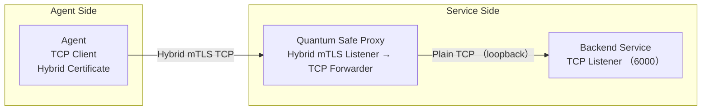

# Quantum Safe Proxy: PQC-Enabled Sidecar with Hybrid Certificate Support

[](https://github.com/JerryR7/quantum-safe-proxy/actions/workflows/rust.yml)
[](https://opensource.org/licenses/MIT)
[](https://crates.io/crates/quantum-safe-proxy)
[](https://docs.rs/quantum-safe-proxy)

## 1. Overview

**Quantum Safe Proxy** is a lightweight TCP proxy designed to secure long-lived connections using **Post-Quantum Cryptography (PQC)** with **hybrid X.509 certificates**. It enables secure mTLS communication via **OpenSSL + oqs-provider**, supporting both traditional and quantum-resistant algorithms through hybrid negotiation.

### Key Goals

- Enable secure communication using **hybrid PQC + classical certificates** (e.g., Kyber + ECDSA)
- Support both PQC-capable and legacy clients transparently
- Deployable as a **sidecar proxy** with no modifications required to existing services
- Provide future-proof security against quantum computing threats

## 2. Architecture

### Architecture Diagram



### How It Works

1. **Client Connection**: Clients connect to the proxy using TLS with hybrid certificates
2. **TLS Termination**: Proxy performs TLS handshake with hybrid certificate support
3. **Certificate Validation**: Mutual TLS authentication with client certificate verification
4. **Traffic Forwarding**: Decrypted traffic is forwarded to the backend service
5. **Response Handling**: Responses from the service are encrypted and sent back to the client

## 3. Key Features

- **Hybrid Certificate Support**: Seamlessly works with hybrid X.509 certificates (Kyber + ECDSA)
- **Quantum-Safe Algorithms**: Support for post-quantum algorithms like Kyber and Dilithium
- **Transparent PQC Integration**: Handles both PQC and traditional clients
- **Automatic Provider Detection**: Automatically detects and uses OQS-OpenSSL when available
- **Environment Diagnostics**: Provides tools to check and diagnose the cryptographic environment
- **Docker Integration**: Pre-built Docker images with OQS-OpenSSL included
- **Efficient TCP Proxying**: High-performance data forwarding with Tokio async runtime
- **Complete mTLS Support**: Client and server certificate validation
- **Flexible Configuration**: Command-line arguments, environment variables, and config files
- **Containerized Deployment**: Docker, docker-compose, and Kubernetes support

## 4. Technology Stack

| Component | Technology |
|-----------|------------|
| **Language** | Rust |
| **TLS Library** | OpenSSL with oqs-provider (hybrid certificate support) |
| **Proxy Runtime** | tokio + tokio-openssl |
| **Deployment** | Docker / Kubernetes / Systemd sidecar mode |
| **Certificate Tools** | OQS OpenSSL CLI (hybrid CSR and certificates) |

## 5. Installation

### From Crates.io

```bash
cargo install quantum-safe-proxy
```

### From Source

```bash
# Clone the repository
git clone https://github.com/JerryR7/quantum-safe-proxy.git
cd quantum-safe-proxy

# Build
cargo build --release
```

### Using Docker

```bash
# Pull the image
docker pull jerryr7/quantum-safe-proxy:latest

# Or build locally
docker build -t quantum-safe-proxy .
```

## 6. Usage

### Basic Usage

```bash
quantum-safe-proxy --listen 0.0.0.0:8443 --target 127.0.0.1:6000 --cert certs/server.crt --key certs/server.key --ca-cert certs/ca.crt
```

### Using Environment Variables

```bash
# Set environment variables
export QUANTUM_SAFE_PROXY_LISTEN="0.0.0.0:9443"
export QUANTUM_SAFE_PROXY_TARGET="127.0.0.1:7000"
export QUANTUM_SAFE_PROXY_CERT="certs/server.crt"
export QUANTUM_SAFE_PROXY_KEY="certs/server.key"
export QUANTUM_SAFE_PROXY_CA_CERT="certs/ca.crt"
export QUANTUM_SAFE_PROXY_LOG_LEVEL="debug"
export QUANTUM_SAFE_PROXY_HYBRID_MODE="true"

# Load configuration from environment variables
quantum-safe-proxy --from-env
```

### Using Configuration File

Create a `config.json` file:

```json
{
  "listen": "0.0.0.0:8443",
  "target": "127.0.0.1:6000",
  "cert_path": "certs/server.crt",
  "key_path": "certs/server.key",
  "ca_cert_path": "certs/ca.crt",
  "hybrid_mode": true,
  "log_level": "info"
}
```

Then run:

```bash
quantum-safe-proxy --config-file config.json
```

### Using Docker

#### Standard Docker Image

```bash
docker run -p 8443:8443 \
  -v $(pwd)/certs:/app/certs \
  jerryr7/quantum-safe-proxy:latest \
  --listen 0.0.0.0:8443 \
```

#### Docker Image with OQS-OpenSSL (Post-Quantum Support)

```bash
docker run -p 8443:8443 \
  -v $(pwd)/certs:/app/certs \
  jerryr7/quantum-safe-proxy:oqs \
  --listen 0.0.0.0:8443 \
```

#### Using Docker Compose

```bash
# Start the proxy with docker-compose
docker-compose up -d

# Check the logs
docker-compose logs -f
```

### Using docker-compose

```bash
docker-compose up -d
```

### Command-line Options

| Option | Description | Default |
|--------|-------------|---------|
| `--listen` | Listen address | 0.0.0.0:8443 |
| `--target` | Target service address | 127.0.0.1:6000 |
| `--cert` | Server certificate path | certs/server.crt |
| `--key` | Server private key path | certs/server.key |
| `--ca-cert` | CA certificate path | certs/ca.crt |
| `--log-level` | Log level (debug, info, warn, error) | info |
| `--hybrid-mode` | Enable hybrid certificate mode | true |
| `--from-env` | Load configuration from environment variables | - |
| `--config-file` | Load configuration from specified file | - |

## 7. Hybrid Certificate Support

Quantum Safe Proxy supports **hybrid X.509 certificates** using OpenSSL with the [OQS-provider](https://github.com/open-quantum-safe/oqs-provider). This allows the server to accept connections from both PQC-enabled and traditional clients.

### Supported Algorithms

| Type | Algorithms |
|------|------------|
| **Key Exchange** | Kyber (NIST PQC standard) |
| **Signatures** | Dilithium (NIST PQC standard) |
| **Classical Fallback** | ECDSA, RSA |

### TLS Handshake Behavior

- During TLS handshake, the server advertises hybrid capabilities
- Clients with PQC support negotiate using quantum-resistant algorithms
- Legacy clients fall back to classical algorithms

### Installing OQS OpenSSL

#### Using the Installation Script

```bash
# Run the installation script
./scripts/install-oqs.sh

# Source the environment variables
source /opt/oqs-openssl/env.sh
```

#### Manual Installation

```bash
# Clone the OQS OpenSSL repository
git clone --branch OQS-OpenSSL_1_1_1-stable https://github.com/open-quantum-safe/openssl.git oqs-openssl
cd oqs-openssl

# Compile and install
./config --prefix=/opt/oqs-openssl shared
make -j$(nproc)
make install
```

### Generating Hybrid Certificates

```bash
# Set environment variables
export PATH="/opt/oqs-openssl/bin:$PATH"
export LD_LIBRARY_PATH="/opt/oqs-openssl/lib:$LD_LIBRARY_PATH"

# Generate hybrid certificate
openssl req -x509 -new -newkey oqsdefault -keyout certs/server.key -out certs/server.crt \
    -config openssl-hybrid.conf -nodes -days 365
```

### Example OpenSSL Configuration

```ini
[req]
distinguished_name = req_distinguished_name
x509_extensions = v3_req
prompt = no

[req_distinguished_name]
CN = quantum-safe-proxy.local
O = Quantum Safe Proxy
OU = Security
C = TW

[v3_req]
subjectAltName = @alt_names
keyUsage = keyEncipherment, digitalSignature
extendedKeyUsage = serverAuth, clientAuth

[alt_names]
DNS.1 = quantum-safe-proxy.local
DNS.2 = localhost
IP.1 = 127.0.0.1
```

## 8. Implementation Details

### Certificate Validation Logic

Quantum Safe Proxy, built on **tokio-openssl**, performs mutual TLS with hybrid certificates:
- Accepts client connections with PQC or classical certificates
- Verifies signatures using appropriate algorithms
- Performs key exchange using hybrid parameters
- Logs certificate information and connection details

### Project Structure

```
quantum-safe-proxy/
├── src/
│   ├── common/            # Shared utilities
│   │   ├── error.rs       # Error handling
│   │   ├── fs.rs          # File system utilities
│   │   ├── log.rs         # Logging utilities
│   │   ├── net.rs         # Network utilities
│   │   ├── types.rs       # Shared types
│   │   └── mod.rs         # Re-exports
│   ├── config/            # Configuration handling
│   │   ├── config.rs      # Configuration structures
│   │   └── mod.rs         # Re-exports
│   ├── proxy/             # Core proxy functionality
│   │   ├── server.rs      # Proxy server implementation
│   │   ├── handler.rs     # Connection handler
│   │   ├── forwarder.rs   # Data forwarding logic
│   │   └── mod.rs         # Re-exports
│   ├── crypto/            # Cryptographic operations
│   │   ├── provider/       # Cryptographic providers
│   │   │   ├── standard.rs # Standard OpenSSL provider
│   │   │   ├── oqs.rs      # OQS-OpenSSL provider
│   │   │   ├── factory.rs  # Provider factory
│   │   │   ├── environment.rs # Environment detection
│   │   │   └── mod.rs      # Provider trait and types
│   │   └── mod.rs          # Re-exports
│   ├── tls/               # TLS and certificate handling
│   │   ├── acceptor.rs    # TLS acceptor creation
│   │   ├── cert.rs        # Certificate operations
│   │   └── mod.rs         # Re-exports
│   ├── main.rs            # Main entry point
│   └── lib.rs             # Library entry point
├── tests/                 # Test suite
│   └── integration_test.rs # Integration tests
├── examples/              # Example applications
│   ├── simple_proxy.rs     # Basic proxy example
│   ├── config_file.rs      # Config file example
│   ├── env_vars.rs         # Environment variables example
│   └── hybrid_certs.rs     # Hybrid certificate example
├── docker/                # Container configurations
│   ├── Dockerfile          # Standard Docker image definition
│   ├── Dockerfile.oqs      # Docker image with OQS-OpenSSL
│   └── docker-compose.yml  # Docker Compose configuration
├── scripts/               # Utility scripts
│   └── install-oqs.sh      # OQS-OpenSSL installation script
├── kubernetes/            # Kubernetes deployment
│   ├── deployment.yaml     # Kubernetes deployment
│   └── service.yaml        # Kubernetes service
└── certs/                 # Certificate directory
```

## 9. Development and Testing

### Running Tests

```bash
# Run all tests
cargo test

# Run specific tests
cargo test --test integration_test
```

### Running Examples

```bash
# Run the simple proxy example
cargo run --example simple_proxy

# Run the hybrid certificates example
cargo run --example hybrid_certs
```

### Code Formatting and Linting

```bash
# Format code
cargo fmt

# Check code with Clippy
cargo clippy
```

## 10. Use Cases

| Scenario | Description |
|----------|-------------|
| **Legacy System Integration** | Secure legacy systems without modifying their code |
| **Quantum-Safe Transition** | Gradually transition to PQC without disrupting services |
| **Zero-Trust Security** | Enhance mTLS with quantum-resistant algorithms |
| **Long-Term Data Protection** | Protect sensitive data against future quantum threats |

## 11. Future Roadmap

- Auto-certificate rotation via REST API
- Hybrid client metrics and handshake logs
- WASM-based certificate authorization plugin
- PQC-only mode with Kyber + Dilithium enforcement
- Performance optimizations for high-throughput scenarios
- Enhanced OQS integration with more PQC algorithms
- Certificate chain validation with hybrid certificates
- Automatic OQS-OpenSSL detection and configuration

## Contributing

Contributions are welcome! Please see [CONTRIBUTING.md](CONTRIBUTING.md) for details on how to contribute to this project.

## License

This project is licensed under the [MIT License](LICENSE).