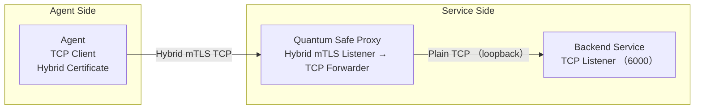

# Quantum Safe Proxy: PQC-Enabled Sidecar with Hybrid Certificate Support

[](https://github.com/JerryR7/quantum-safe-proxy/actions/workflows/rust.yml)
[](https://opensource.org/licenses/MIT)
[](https://crates.io/crates/quantum-safe-proxy)
[](https://docs.rs/quantum-safe-proxy)

## 1. Overview

**Quantum Safe Proxy** is a lightweight TCP proxy designed to secure long-lived connections using **Post-Quantum Cryptography (PQC)** with **hybrid X.509 certificates**. It enables secure mTLS communication via **OpenSSL with post-quantum support**, supporting both traditional and quantum-resistant algorithms through hybrid negotiation.

### Key Goals

- Enable secure communication using **hybrid PQC + classical certificates** (e.g., Kyber + ECDSA)
- Support both PQC-capable and legacy clients transparently
- Deployable as a **sidecar proxy** with no modifications required to existing services
- Provide future-proof security against quantum computing threats

## 2. Architecture

### Architecture Diagram



### How It Works

1. **Client Connection**: Clients connect to the proxy using TLS with hybrid certificates
2. **TLS Termination**: Proxy performs TLS handshake with hybrid certificate support
3. **Certificate Validation**: Mutual TLS authentication with client certificate verification
4. **Traffic Forwarding**: Decrypted traffic is forwarded to the backend service
5. **Response Handling**: Responses from the service are encrypted and sent back to the client

## 3. Key Features

- **Hybrid Certificate Support**: Seamlessly works with hybrid X.509 certificates (Kyber + ECDSA)
- **Quantum-Safe Algorithms**: Support for post-quantum algorithms like Kyber and Dilithium
- **Transparent PQC Integration**: Handles both PQC and traditional clients
- **Automatic Provider Detection**: Automatically detects and uses OQS-OpenSSL when available
- **Environment Diagnostics**: Provides tools to check and diagnose the cryptographic environment
- **Docker Integration**: Pre-built Docker images with OQS-OpenSSL included
- **Efficient TCP Proxying**: High-performance data forwarding with Tokio async runtime
- **Complete mTLS Support**: Client and server certificate validation
- **Flexible Configuration**: Command-line arguments, environment variables, and config files
- **Containerized Deployment**: Docker, docker-compose, and Kubernetes support

## 4. Technology Stack

| Component | Technology |
|-----------|------------|
| **Language** | Rust |
| **TLS Library** | OpenSSL 3.5+ with built-in PQC support or OpenSSL with oqs-provider |
| **Proxy Runtime** | tokio + tokio-openssl |
| **Deployment** | Docker / Kubernetes / Systemd sidecar mode |
| **Certificate Tools** | OpenSSL 3.5+ CLI or OQS OpenSSL CLI (hybrid CSR and certificates) |

## 5. Installation

### System Requirements

- Linux operating system (Ubuntu, Debian, etc.)
- OpenSSL 3.5.0 (installed at `/opt/openssl-3.5.0/`)
- Rust development environment (if compiling from source)

### Option 1: From Crates.io

```bash
cargo install quantum-safe-proxy
```

### Option 2: From Source

```bash
# Clone the repository
git clone https://github.com/JerryR7/quantum-safe-proxy.git
cd quantum-safe-proxy

# Build with default OpenSSL 3.5.0 path
cargo build --release

# Or specify a custom OpenSSL path
OPENSSL_DIR=/path/to/openssl cargo build --release
```

The project uses a `build.rs` script that automatically embeds the OpenSSL library path into the binary, so you don't need to set environment variables when running the program.

### Option 3: Using Docker (Recommended)

Using Docker is the simplest method, as it doesn't require installing OpenSSL 3.5.0 on your local machine:

```bash
# Pull the image
docker pull jerryr7/quantum-safe-proxy:latest

# Or build locally
docker build -t quantum-safe-proxy .

# Using docker-compose
docker-compose up

# Or directly using docker command
docker build -t quantum-safe-proxy:openssl35 -f docker/Dockerfile.openssl35 .
docker run -p 8443:8443 quantum-safe-proxy:openssl35
```

### Option 4: Manual OpenSSL 3.5.0 Installation

If you need to install OpenSSL 3.5.0 on your local machine:

```bash
# Install build tools
sudo apt-get update
sudo apt-get install -y build-essential git

# Download OpenSSL 3.5.0 source code
mkdir -p ~/src
cd ~/src
git clone --depth 1 --branch openssl-3.5.0 https://github.com/openssl/openssl.git

# Compile and install OpenSSL 3.5.0
cd openssl
./config --prefix=/opt/openssl-3.5.0 \
         --openssldir=/opt/openssl-3.5.0/ssl \
         --libdir=lib \
         enable-shared \
         -Wl,-rpath=/opt/openssl-3.5.0/lib
make -j$(nproc)
sudo make install

# Create symbolic links if needed
if [ -d /opt/openssl-3.5.0/lib64 ] && [ ! -d /opt/openssl-3.5.0/lib ]; then
    sudo ln -s /opt/openssl-3.5.0/lib64 /opt/openssl-3.5.0/lib
elif [ -d /opt/openssl-3.5.0/lib ] && [ ! -d /opt/openssl-3.5.0/lib64 ]; then
    sudo ln -s /opt/openssl-3.5.0/lib /opt/openssl-3.5.0/lib64
fi
```

## 6. Usage

### Basic Usage

```bash
quantum-safe-proxy --listen 0.0.0.0:8443 --target 127.0.0.1:6000 --cert certs/hybrid/dilithium3/server.crt --key certs/hybrid/dilithium3/server.key --ca-cert certs/hybrid/dilithium3/ca.crt --client-cert-mode optional
```

### Using Environment Variables

```bash
# Set environment variables
export QUANTUM_SAFE_PROXY_LISTEN="0.0.0.0:9443"
export QUANTUM_SAFE_PROXY_TARGET="127.0.0.1:7000"
export QUANTUM_SAFE_PROXY_CERT="certs/hybrid/dilithium3/server.crt"
export QUANTUM_SAFE_PROXY_KEY="certs/hybrid/dilithium3/server.key"
export QUANTUM_SAFE_PROXY_CA_CERT="certs/hybrid/dilithium3/ca.crt"
export QUANTUM_SAFE_PROXY_LOG_LEVEL="debug"
export QUANTUM_SAFE_PROXY_HYBRID_MODE="true"
export QUANTUM_SAFE_PROXY_CLIENT_CERT_MODE="optional"

# Load configuration from environment variables
quantum-safe-proxy --from-env
```

### Using Configuration File

You can use the provided example configuration file as a starting point:

```bash
cp config.json.example config.json
# Edit config.json to match your requirements
```

The configuration file uses JSON format and supports the following options:

| Option | Description | Default |
|--------|-------------|--------|
| `listen` | Listen address for the proxy server | `0.0.0.0:8443` |
| `target` | Target service address to forward traffic to | `127.0.0.1:6000` |
| `cert_path` | Server certificate path | `certs/hybrid/dilithium3/server.crt` |
| `key_path` | Server private key path | `certs/hybrid/dilithium3/server.key` |
| `ca_cert_path` | CA certificate path for client certificate validation | `certs/ca.crt` |
| `hybrid_mode` | Whether to enable hybrid certificate mode | `true` |
| `client_cert_mode` | Client certificate verification mode: `required`, `optional`, or `none` | `optional` |
| `log_level` | Log level: `debug`, `info`, `warn`, or `error` | `info` |
| `environment` | Environment: `development`, `testing`, or `production` | `production` |

Example configuration file:

```json
{
  "listen": "0.0.0.0:8443",
  "target": "127.0.0.1:6000",
  "cert_path": "certs/hybrid/dilithium3/server.crt",
  "key_path": "certs/hybrid/dilithium3/server.key",
  "ca_cert_path": "certs/hybrid/dilithium3/ca.crt",
  "hybrid_mode": true,
  "client_cert_mode": "optional",
  "log_level": "info",
  "environment": "production"
}
```

Then run:

```bash
quantum-safe-proxy --config-file config.json
```

### Configuration Hot Reload

Quantum Safe Proxy supports hot reloading of configuration without restarting the service:

#### On Unix-like Systems (Linux, macOS)

Send a SIGHUP signal to the process:

```bash
# Find the process ID
pidof quantum-safe-proxy

# Send SIGHUP signal
kill -HUP <process_id>
```

#### On Windows

On Windows, the proxy automatically checks for configuration file changes every 30 seconds. Simply modify and save the configuration file, and it will be reloaded automatically.

#### What Gets Reloaded

The following configuration options can be changed during hot reload:

- Target service address
- TLS certificates and keys
- Client certificate verification mode
- Log level

Note that the listen address cannot be changed during hot reload, as this would require restarting the listener.


### Using Docker

#### 1. Build Docker Images

Before using Docker Compose, first build the Docker images manually. This provides better control over the build process and prevents dangling (`<none>`) images.

##### Standard Docker Image

```bash
# Run in the project root directory
docker build -f docker/Dockerfile -t quantum-safe-proxy:latest .
```

##### Docker Image with OpenSSL 3.5 (Built-in Post-Quantum Support)

```bash
# Run in the project root directory
docker build -f docker/Dockerfile.openssl35 -t quantum-safe-proxy:openssl35 .
```

##### Docker Image with OQS-OpenSSL (Legacy Post-Quantum Support)

```bash
# Run in the project root directory
docker build -f docker/Dockerfile.oqs -t quantum-safe-proxy:oqs .
```

#### 2. Using Docker Run

```bash
# Standard image
docker run -p 8443:8443 \
  -v $(pwd)/certs:/app/certs \
  quantum-safe-proxy:latest \
  --listen 0.0.0.0:8443 \
  --target 127.0.0.1:6000 \
  --cert /app/certs/hybrid/dilithium3/server.crt \
  --key /app/certs/hybrid/dilithium3/server.key \
  --ca-cert /app/certs/hybrid/dilithium3/ca.crt \
  --client-cert-mode optional

# OpenSSL 3.5 image (with built-in post-quantum support)
docker run -p 8443:8443 \
  -v $(pwd)/certs:/app/certs \
  quantum-safe-proxy:openssl35 \
  --listen 0.0.0.0:8443 \
  --target 127.0.0.1:6000 \
  --cert /app/certs/hybrid/ml-dsa-65/server.crt \
  --key /app/certs/hybrid/ml-dsa-65/server.key \
  --ca-cert /app/certs/hybrid/ml-dsa-65/ca.crt \
  --client-cert-mode optional

# OQS image (with legacy post-quantum support)
docker run -p 8443:8443 \
  -v $(pwd)/certs:/app/certs \
  quantum-safe-proxy:oqs \
  --listen 0.0.0.0:8443 \
  --target 127.0.0.1:6000 \
  --cert /app/certs/hybrid/dilithium3/server.crt \
  --key /app/certs/hybrid/dilithium3/server.key \
  --ca-cert /app/certs/hybrid/dilithium3/ca.crt \
  --client-cert-mode optional
```

#### 3. Using Docker Compose

Make sure your `docker-compose.yml` file uses the pre-built images:

```yaml
services:
  quantum-safe-proxy:
    # Choose one of the following images:
    image: quantum-safe-proxy:openssl35  # Use OpenSSL 3.5 with built-in PQC
    # image: quantum-safe-proxy:oqs      # Use legacy OQS provider
    ports:
      - "8443:8443"
    volumes:
      - ./certs:/app/certs
      - ./config:/app/config
    # other configuration...
```

Then start the services:

```bash
# Start the proxy with docker-compose
docker-compose up -d

# Check the logs
docker-compose logs -f
```

#### 4. Updating Images

When your code changes and you need to update the images:

```bash
# Rebuild the image
docker build -f docker/Dockerfile.oqs -t quantum-safe-proxy:oqs .

# Restart the services
docker-compose down
docker-compose up -d
```

#### 5. Why This Approach?

We recommend building images manually and using only `image:` in docker-compose.yml (without `build:` sections) for several reasons:

- **Prevents dangling images**: Avoids the creation of `<none>` tagged images that waste disk space
- **Better control**: Gives you more visibility and control over the build process
- **Clearer versioning**: Makes it easier to manage different versions of your images
- **Faster startup**: Docker Compose starts faster as it doesn't need to check if rebuilding is necessary
- **Consistent with CI/CD practices**: Aligns with how images are typically handled in production environments

### Command-line Options

| Option | Description | Default |
|--------|-------------|---------|
| `--listen` | Listen address | 0.0.0.0:8443 |
| `--target` | Target service address | 127.0.0.1:6000 |
| `--cert` | Server certificate path | certs/hybrid/dilithium3/server.crt |
| `--key` | Server private key path | certs/hybrid/dilithium3/server.key |
| `--ca-cert` | CA certificate path | certs/hybrid/dilithium3/ca.crt |
| `--log-level` | Log level (debug, info, warn, error) | info |
| `--hybrid-mode` | Enable hybrid certificate mode | true |
| `--client-cert-mode` | Client certificate verification mode (required, optional, none) | optional |
| `--from-env` | Load configuration from environment variables | - |
| `--config-file` | Load configuration from specified file | - |

## 7. Hybrid Certificate Support

Quantum Safe Proxy supports **hybrid X.509 certificates** using either OpenSSL 3.5+ with built-in PQC support or OpenSSL with the [OQS-provider](https://github.com/open-quantum-safe/oqs-provider). This allows the server to accept connections from both PQC-enabled and traditional clients.

### Supported Algorithms

| Type | Algorithms (OpenSSL 3.5+) | Algorithms (OQS Provider) |
|------|--------------------------|---------------------------|
| **Key Exchange** | ML-KEM (formerly Kyber, NIST PQC standard) | Kyber (NIST PQC standard) |
| **Signatures** | ML-DSA (formerly Dilithium, NIST PQC standard) | Dilithium (NIST PQC standard) |
| **Classical Fallback** | ECDSA, RSA | ECDSA, RSA |

### TLS Handshake Behavior

- During TLS handshake, the server advertises hybrid capabilities
- Clients with PQC support negotiate using quantum-resistant algorithms
- Legacy clients fall back to classical algorithms

### Installing Post-Quantum Cryptography Support

#### Option 1: Using OpenSSL 3.5+ (Recommended)

OpenSSL 3.5+ includes built-in support for post-quantum cryptography algorithms standardized by NIST.

```bash
# Run the installation script
./scripts/build-openssl35.sh

# Verify the installation
docker run --rm quantum-safe-proxy:openssl35 /opt/openssl35/bin/openssl version
docker run --rm quantum-safe-proxy:openssl35 /opt/openssl35/bin/openssl list -kem-algorithms | grep -i ML-KEM
```

#### Option 2: Using OQS Provider (Legacy Support)

```bash
# Run the installation script
./scripts/install-oqs-provider.sh

# Source the environment variables
source /opt/oqs/env.sh
```

#### Option 3: Using Legacy OQS OpenSSL (Deprecated)

```bash
# Run the installation script
./scripts/install-oqs.sh

# Source the environment variables
source /opt/oqs-openssl/env.sh
```

### Generating Hybrid Certificates

#### Using OpenSSL 3.5+ (Recommended)

```bash
# Run the certificate generation script in the Docker container
docker compose -f docker-compose.yml exec quantum-safe-proxy /app/scripts/generate-openssl35-certs.sh

# Or generate a specific certificate manually
docker run --rm -v $(pwd)/certs:/app/certs quantum-safe-proxy:openssl35 /opt/openssl35/bin/openssl req -x509 -new -newkey ML-DSA-65 -keyout /app/certs/hybrid/ml-dsa-65/server.key -out /app/certs/hybrid/ml-dsa-65/server.crt -nodes -days 365 -subj "/CN=Hybrid ML-DSA-65/O=Quantum Safe Proxy/OU=Testing/C=TW"
```

#### Using OQS Provider (Legacy)

```bash
# Set environment variables
export PATH="/opt/oqs/openssl/bin:$PATH"
export LD_LIBRARY_PATH="/opt/oqs/openssl/lib64:/opt/oqs/liboqs/lib:$LD_LIBRARY_PATH"

# Generate hybrid certificate
openssl req -x509 -new -newkey dilithium3 -keyout certs/hybrid/dilithium3/server.key -out certs/hybrid/dilithium3/server.crt \
    -config scripts/openssl-hybrid.conf -nodes -days 365
```

### Example OpenSSL Configuration

```ini
[req]
distinguished_name = req_distinguished_name
x509_extensions = v3_req
prompt = no

[req_distinguished_name]
CN = quantum-safe-proxy.local
O = Quantum Safe Proxy
OU = Security
C = TW

[v3_req]
subjectAltName = @alt_names
keyUsage = keyEncipherment, digitalSignature
extendedKeyUsage = serverAuth, clientAuth

[alt_names]
DNS.1 = quantum-safe-proxy.local
DNS.2 = localhost
IP.1 = 127.0.0.1
```

## 8. Implementation Details

### Certificate Validation Logic

Quantum Safe Proxy, built on **tokio-openssl**, performs mutual TLS with hybrid certificates:
- Accepts client connections with PQC or classical certificates
- Verifies signatures using appropriate algorithms
- Performs key exchange using hybrid parameters
- Logs certificate information and connection details

### Project Structure

```
quantum-safe-proxy/
├── src/
│   ├── common/            # Shared utilities
│   │   ├── error.rs       # Error handling
│   │   ├── fs.rs          # File system utilities
│   │   ├── log.rs         # Logging utilities
│   │   ├── net.rs         # Network utilities
│   │   ├── types.rs       # Shared types
│   │   └── mod.rs         # Re-exports
│   ├── config/            # Configuration handling
│   │   ├── config.rs      # Configuration structures
│   │   └── mod.rs         # Re-exports
│   ├── proxy/             # Core proxy functionality
│   │   ├── server.rs      # Proxy server implementation
│   │   ├── handler.rs     # Connection handler
│   │   ├── forwarder.rs   # Data forwarding logic
│   │   └── mod.rs         # Re-exports
│   ├── crypto/            # Cryptographic operations
│   │   ├── provider/       # Cryptographic providers
│   │   │   ├── standard.rs # Standard OpenSSL provider
│   │   │   ├── oqs.rs      # OQS-OpenSSL provider
│   │   │   ├── factory.rs  # Provider factory
│   │   │   ├── environment.rs # Environment detection
│   │   │   └── mod.rs      # Provider trait and types
│   │   └── mod.rs          # Re-exports
│   ├── tls/               # TLS and certificate handling
│   │   ├── acceptor.rs    # TLS acceptor creation
│   │   ├── cert.rs        # Certificate operations
│   │   └── mod.rs         # Re-exports
│   ├── main.rs            # Main entry point
│   └── lib.rs             # Library entry point
├── tests/                 # Test suite
│   └── integration_test.rs # Integration tests
├── examples/              # Example applications
│   ├── simple_proxy.rs     # Basic proxy example
│   ├── config_file.rs      # Config file example
│   ├── env_vars.rs         # Environment variables example
│   └── hybrid_certs.rs     # Hybrid certificate example
├── docker/                # Container configurations
│   ├── Dockerfile          # Standard Docker image definition
│   ├── Dockerfile.oqs      # Docker image with OQS-OpenSSL
│   └── docker-compose.yml  # Docker Compose configuration
├── scripts/               # Utility scripts
│   └── install-oqs.sh      # OQS-OpenSSL installation script
├── kubernetes/            # Kubernetes deployment
│   ├── deployment.yaml     # Kubernetes deployment
│   └── service.yaml        # Kubernetes service
├── certs/                 # Certificate directory
└── config.json.example    # Example configuration file
```

## 9. Development and Testing

### Running Tests

```bash
# Run all tests
cargo test

# Run specific tests
cargo test --test integration_test
```

### Running Examples

```bash
# Run the simple proxy example
cargo run --example simple_proxy

# Run the hybrid certificates example
cargo run --example hybrid_certs
```

### Code Formatting and Linting

```bash
# Format code
cargo fmt

# Check code with Clippy
cargo clippy
```

## 10. Use Cases

| Scenario | Description |
|----------|-------------|
| **Legacy System Integration** | Secure legacy systems without modifying their code |
| **Quantum-Safe Transition** | Gradually transition to PQC without disrupting services |
| **Zero-Trust Security** | Enhance mTLS with quantum-resistant algorithms |
| **Long-Term Data Protection** | Protect sensitive data against future quantum threats |

## 11. Troubleshooting

### OpenSSL 3.5.0 Issues

#### 1. OpenSSL 3.5.0 not found or cannot be loaded

Verify that OpenSSL 3.5.0 is correctly installed:

```bash
/opt/openssl-3.5.0/bin/openssl version
```

#### 2. Post-quantum algorithms not found

Check if post-quantum algorithms are supported:

```bash
/opt/openssl-3.5.0/bin/openssl list -kem-algorithms | grep -i ML-KEM
/opt/openssl-3.5.0/bin/openssl list -signature-algorithms | grep -i ML-DSA
```

#### 3. Compilation error: cc tool not found

Install necessary build tools:

```bash
sudo apt-get update
sudo apt-get install -y build-essential pkg-config libssl-dev
```

#### 4. Runtime error: ee key too small

This indicates that the certificate's key is too small for OpenSSL's security requirements. Try using a different certificate:

```json
{
  "cert_path": "certs/hybrid/ml-dsa-65/server.crt",
  "key_path": "certs/hybrid/ml-dsa-65/server.key",
  "ca_cert_path": "certs/hybrid/ml-dsa-65/ca.crt"
}
```

#### 5. Dynamic linking errors

If you're experiencing dynamic linking errors despite having OpenSSL 3.5.0 installed, you can manually set up the dynamic linker:

```bash
sudo mkdir -p /etc/ld.so.conf.d
echo "/opt/openssl-3.5.0/lib" | sudo tee /etc/ld.so.conf.d/openssl35.conf
echo "/opt/openssl-3.5.0/lib64" | sudo tee -a /etc/ld.so.conf.d/openssl35.conf
sudo ldconfig
```

## 12. Future Roadmap

- Auto-certificate rotation via REST API
- Hybrid client metrics and handshake logs
- WASM-based certificate authorization plugin
- PQC-only mode with Kyber + Dilithium enforcement
- Performance optimizations for high-throughput scenarios
- Enhanced OQS integration with more PQC algorithms
- Certificate chain validation with hybrid certificates
- Automatic OQS-OpenSSL detection and configuration

## 13. Documentation

Detailed documentation is available in the `docs/` directory:

- [Comprehensive Guide](docs/guide.md): Complete guide covering installation, certificates, cryptography, utility scripts, and troubleshooting

See [docs/README.md](docs/README.md) for additional resources and information.

## 14. Contributing

Contributions are welcome! Please see [CONTRIBUTING.md](CONTRIBUTING.md) for details on how to contribute to this project.

## 15. License

This project is licensed under the [MIT License](LICENSE).